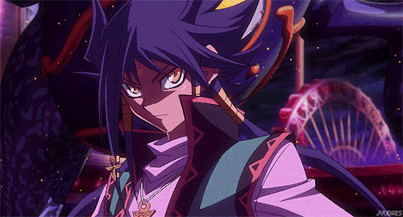

  <h1> Hey! Nice to see you.</h1>
  <h2>Welcome to my page!   I'm Erick Willian, Fullstack developer evolving from  <b>Brazil</b>.

   
   
  

 

<h3>Things I code with</h3>

      

 
 

## About ME 💬 :

### - Learning :

- ✨ Data Structures & Algorithms
- ✨ CSS Responsiveness

### - Hobbies :

- ✨ Gaming Addict
- ✨ A big fan of Yu-Gi-Oh
- ✨ Watching Anime
- ✨ read fantasy books
- ✨ Play chess

 

# Contact Me :

  
 

  
  
   
  
  If you want to reach out to me about anything, be it some doubt or just to hangout and talk or want to game together just ping me 😉.
  
   

  

  
  
  
  

 
 
 
 
 
 
 

  <a href="https://github.com/EriickW">
  
  

   

- 💼 any freelance work? do reach, <a href="mailto:erickwillian223@gmail.com">email</a> :)

- 💬 ask me about anything, i am happy to help;

 

    Let's work together to build something great

  
